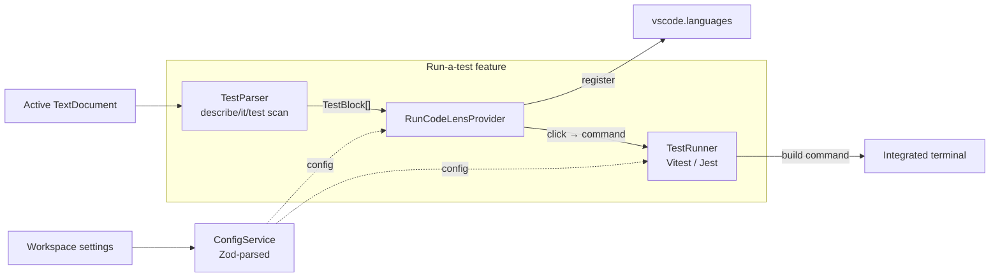

# Architecture

## Philosophy

**Composition > inheritance, interfaces > implementations, explicit > magic.**
Each module has one responsibility, is testable in isolation, and is swappable
through DI without rewriting surrounding code.

## High-level flow



1. **Bootstrap** (`src/main.ts`) resolves `ConfigService`, registers
   infrastructure tokens (logger, telemetry), attaches `Lifecycle` to the
   extension context, and starts the `ConfigReloader`.
2. **CodeLens** — `RunCodeLensProvider` parses the active document for
   `describe`/`it`/`test` calls, emits one "Run" lens per block with its line
   range and resolved test name (the full ancestor path, joined by spaces;
   dynamic / `.each` titles fall back to running the whole file).
3. **Run** — clicking a lens fires the `oleshkoTestUtils.runTest` command
   carrying the file path + test name. `TestRunner` detects Vitest or Jest,
   builds the scoped command, and runs it in the VS Code integrated terminal.

The feature works per open document — there is no whole-workspace scan,
watcher, or symbol index. Parsing is cheap and local.

## Domain map

```
src/
├── extension entry
│   ├── index.ts                   activate / deactivate; ESM entry
│   └── main.ts                    DI registration + bootstrap orchestration
├── config/                        Zod schema + ConfigService + reloader
├── lifecycle/                     Disposables, shutdown hooks, error handlers
├── logger/                        Pino → VSCode LogOutputChannel
├── telemetry/                     vscode.env.createTelemetryLogger + noop
├── parser/                        describe/it/test extraction from a document
├── providers/                     RunCodeLensProvider
├── runner/                        TestRunner: detect + build command + terminal
├── constants.ts                   IDs, namespaces, log level + runner enums
└── types/                         tiny shared type helpers
```

Each `domain/` follows the same shape:

```
domain/
  base-xxx.ts           abstract class (the public contract)
  standard-xxx.ts       default concrete implementation
  noop-xxx.ts           opt-out implementation (where applicable)
  index.ts              picker function — only public entry
  helpers/              private-to-domain helpers
  types.ts              domain-local types
```

## Lifecycle

`Lifecycle.attach(context)` stores the extension context and pushes any
disposables registered before activation into `context.subscriptions`.
After that, `lifecycle.register(disposable)` pushes directly into
`context.subscriptions` so VSCode disposes them on deactivate. We do **not**
maintain a parallel disposable list — VSCode is the source of truth.

`onShutdown(fn)` queues a coroutine that runs in reverse on `deactivate`.
Useful for flushing logs/telemetry; not used for VSCode resources.

## Why this shape

- **In-process, not LSP.** Single editor (VSCode), no protocol overhead. The
  CodeLens provider and parser run in the extension host.
- **No persistent index.** A test file is parsed on demand when VSCode requests
  CodeLenses for it. Cheap, always fresh, nothing to invalidate.
- **Runner is data, not a class hierarchy.** Vitest and Jest differ only in the
  command they build (binary, subcommand, name flag) — captured as a
  `RunnerSpec` in [`runner/helpers/command.ts`](../src/runner/helpers/command.ts).
  A single `TerminalTestRunner` detects the runner + package manager for the
  file's workspace folder (`auto` reads `package.json`; lockfiles pick the PM
  exec prefix), builds the command, and runs it in one reused integrated
  terminal. Pure command/detection logic stays in `helpers/` and is unit-tested
  without `vscode`.
